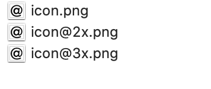

    

    
    
    

Appetizer is a macOS command line tool that takes an image (in PNG or JPG format) and makes suitable iOS and Android images and app icons.

## Usage

### Command Line

The command `appetizer --help` will print information about the arguments.

#### Android Icon

`appetizer icon.png 100 100 --androidIcon output`

This will create 5 folders in an `output` folder, each containing `icon.png` images of different sizes:

The image in `drawable-mdpi` will have the size 100x100. The others will have greater size.

You can set another name for the android folders, like `mipmap`:

`appetizer icon.png 100 100 --androidIcon output --androidFolderPrefix mipmap`

#### iOS Icon

`appetizer icon.png 100 100 --iosIcon output`

This will create 3 images in the `output` folder:

The size will be 100x100 for `icon.png`, 200x200 for `icon@2x.png` and 300x300 for `icon@3x.png`.

#### iOS App Icon

`appetizer icon.png 100 100 --iosAppIcon output`

This will create many images in the `output` folder:

The images have each size needed to fully specify an app icon on iOS for the iPhone and the iPad, including the 1024x1024 App Store icon.

#### Single Icon

`appetizer icon.png 100 100 --singleIcon output`

This will create one image in the `output` folder: `icon.png`. The size will be 100x100.

## Installation

### Binary release

Download an appetizer binary from the release section and copy it into the folder `/usr/local/bin` so that it can be launched from anywhere in the command line.

### Compile the source

You can compile the source using the command line:

`swift build -c release`

Then copy the `appetizer` binary from the folder `.build/release` to `/usr/local/bin` so that it can be launched from anywhere in the command line.

## TODO

* Make a macOS app, which has the same functions but with a GUI instead of a command line tool. Users should then be able to use either the command line or the GUI tool.
